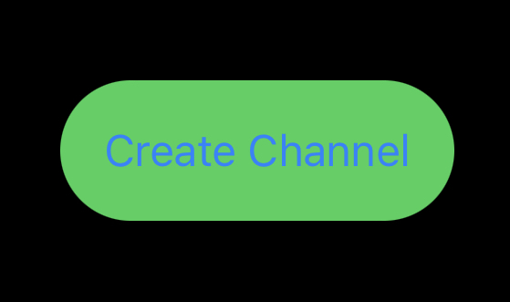
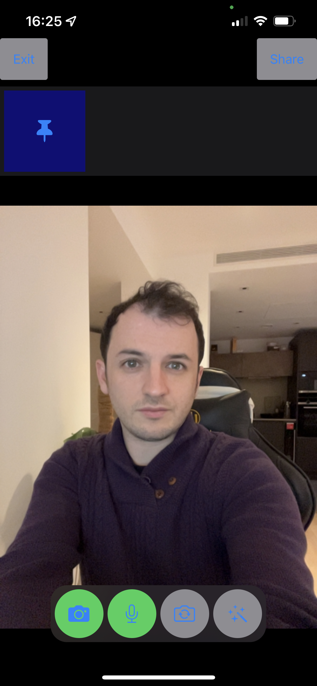
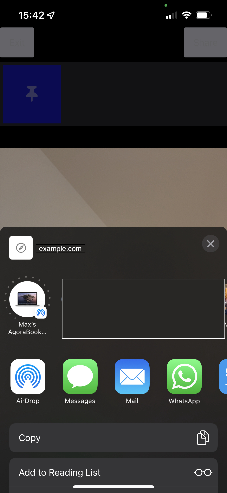
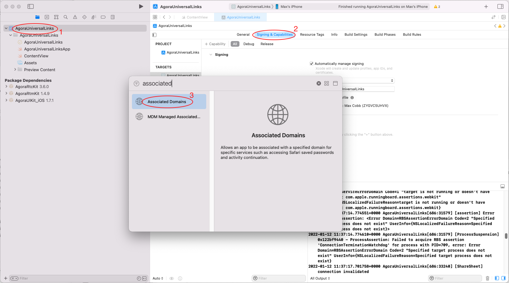
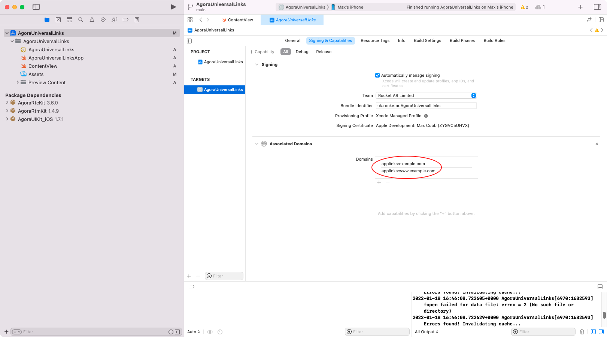
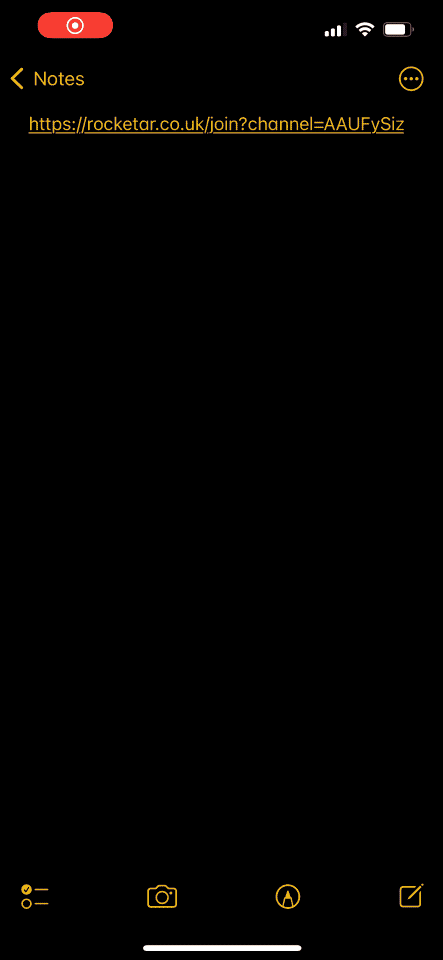

# Universal Links and SwiftUI Video Calls

When making a video call application, you may want to share links to let your users fiends jump into the same video call or live stream that you're watching. The second best way this can be achieved is by sharing a room code for people to type into their version of the app, but a much better option is to share a link that opens the app right to the place you want. That is where we can use Universal Links.

## What are Universal Links?

Often, if there is an equivalent web page for a page that exists within an app. For example, if you're viewing an Instagram profile on your phone's web browser, there is also a way to show the same content within the Instagram app. Universal links are the gateway for going from the web browser content to the app's equivalent content.

Universal links can in some cases not have a web equivalent; such as a complex game that will not run in a web browser. A universal link in that scenario could lead to a template page, which can then be passed through to your application to render the full content or join the game.

Check out Apple's documentation for more information on what Universal Links are:

https://developer.apple.com/ios/universal-links/

Universal Links also work on Android devices, but the setup on your website as well as the device is a little different.

## Prerequisites

- [An Agora Developer Account - Sign up here](https://sso.agora.io/en/signup?utm_source=medium&utm_medium=blog&utm_campaign=universal-links-and-swiftui-video-calls)
- Xcode 12.3 or later
- A physical iOS device with iOS 13.0 or later
- A public server with an SSL certificate (https)

## Setting Up Universal Links

Setting up universal links has been made easier in recent years, but still has two main steps:

1. Setting Up the Website
2. Setting Up the App

Let's start with the website side, to get that over with.

### Setting Up the Website

This section is probably the easiest part of Universal Links. All you need to do is add a file named `apple-app-site-association`, which contains the right values:

```json
{
  "applinks": {
    "apps": [],
    "details": [
      {
        "appIDs": ["DEVELOPMENT_TEAM.PRODUCT_BUNDLE_IDENTIFIER"],
        "components": [
          {
            "/": "*"
          }
        ]
      }
    ]
  }
}
```

The above example will put a universal link button on every page of your website, see below how to specify specific URLs within your domain.

You just need to replace DEVELOPMENT_TEAM and PRODUCT_BUNDLE_IDENTIFIER with the associated values from your app. To find them you can run a couple of commands into terminal from your project's root folder, such as this:

```bash
grep -r -m 1 "DEVELOPMENT_TEAM" .; grep -r -m 1 "PRODUCT_BUNDLE_IDENTIFIER" .
```

Your terminal will look similar to this:

```bash
 => grep -r -m 1 "DEVELOPMENT_TEAM" .; grep -r -m 1 "PRODUCT_BUNDLE_IDENTIFIER" .
./AppName.xcodeproj/project.pbxproj:				DEVELOPMENT_TEAM = 278494H572;
./AppName.xcodeproj/project.pbxproj:				PRODUCT_BUNDLE_IDENTIFIER = io.agora.AppName;

```

In this case, the values we want are `278494H572` and `io.agora.AppName` respectively.

To check that your website is set up correctly, head to [branch.io's validator](https://branch.io/resources/aasa-validator/). One common issue is that the `content-type` header cannot be found. If you face this issue, you will need to create or add these lines to `.htaccess` at the same location as the `apple-app-site-association` file:

```apacheconf
<Files "apple-app-site-association">
ForceType 'application/json'
</Files>
```

---

With the current setup, all pages on the website will link through to the specified app. If you just want a specific part of your website to link to an app, you can add modify the components array object or add another one. For example, if the current components array is replaced with:

```json
"components": [
  { "/": "/wwdc/news" },
  { "/": "/videos/wwdc/2015/*" }
]
```

Then all the WWDC news articles would direct to the app, as well as all videos from 2015.

More examples can be found in Apple's documentation [here](https://developer.apple.com/documentation/xcode/supporting-associated-domains).

For our app, we are going to add the following component:

```json
{
  "/": "/join*",
  "?": { "channel": "?*" }
}
```

Using example.com as our domain address, this is what an example of this full URL could look like:

`https://www.example.com/join?channel=dkvn3lw2`

For more information about how to set up Universal Links with an `apple-app-site-association` file, Apple has a great resource from WWDC 2019 [here](https://developer.apple.com/videos/play/wwdc2019/717).

The full file should look like this:

```json
{
  "applinks": {
    "details": [
      {
        "appIDs": ["DEVELOPMENT_TEAM.PRODUCT_BUNDLE_IDENTIFIER"],
        "components": [
          {
            "/": "/join/*",
            "?": {
              "channel": "?*"
            }
          }
        ]
      }
    ]
  }
}

```

Now that that's set up, let's get to the app portion of our app.

### Setting Up the App

#### Installing the Package

Set up a new SwiftUI app in Xcode, and head add the following Swift Package to your:

`https://github.com/AgoraIO-Community/iOS-UIKit.git`

> The current stable release of Agora UIKit is 1.7.1

If you're not sure how to add a Swift Package, Apple's documentation has it covered with clear steps:

https://developer.apple.com/documentation/swift_packages/adding_package_dependencies_to_your_app

#### Setting the Views

We'll get this part out of the way quickly, as we want to get back to the Universal Links part of this guide. The first thing we need to do is add a button to create and join a channel:

```swift
Button {
  // click action here
} label: {
  Text("Create Channel")
    .padding().background(.green).cornerRadius(30)
}

```

<p align="center" width="200px">
  
</p>

By clicking this button we need to create a channel name and display an AgoraViewer. AgoraViewer is a subclass of View that is provided by Agora UIKit. This can be achieved with the following block of code:

```swift
import SwiftUI
import AgoraRtcKit
import AgoraUIKit_iOS

struct ContentView: View {
  @State var channelName: String?
  @State var isShowingVideo: Bool = false

  var videoCallView: some View {
    VStack {
      HStack { /* Other buttons will be placed here */ }
      ContentView.agview
    }
  }
  static var agview: AgoraViewer = {
    AgoraViewer(
      connectionData: AgoraConnectionData(
        appId: <#Agora App Id#>, rtcToken: <#Agora Token#>
      ), style: .floating
    )
  }()

  var body: some View {
    NavigationView {
      ZStack {
        NavigationLink(
          destination: self.videoCallView
            .navigationBarHidden(true)
            .onAppear(perform: { /* appear action */ })
            .onDisappear(perform: { /* disappear action */ }),
          isActive: $isShowingVideo
        ) { EmptyView() }
        HStack {
          Button {
            self.channelName = "test"
            self.isShowingVideo = true
          } label: {
            Text("Create Channel")
            .padding().background(.green).cornerRadius(30)
          }
        }
      }
    }
  }
}
```

Above, the channel is set to a static string `"test"`, and the property isShowingVideo is set to true. The "test" string will be replaced with a random string generator in the final product on GitHub.

isShowingVideo is a boolean which is used to decide if the video call view (`videoCallView`) should be presented or not by the NavigationView. The next things to add are quite straightforward, we need to join and leave the channel using the onAppear and onDisappear methods, and add some buttons to the top of the camera view.

```swift
.onAppear(perform: {
  guard let channelName = self.channelName else {
    self.isShowingVideo = false
    return
  }
  ContentView.agview.join(
    channel: channelName, with: nil, as: .broadcaster
  )
})
.onDisappear(perform: {
  ContentView.agview.viewer.leaveChannel()
})
```

If channelName is nil when the video view is appearing then we will close it again, this is because a channel name is required, so something must have gone wrong getting to this stage. After that we call the builtin function from Agora UIKit to join the channel as a broadcaster. The second parameter in the join method is for a token, which I am not using in my test application, but is required for production apps that use Agora.

To find out more about working with tokens using Agora's SDKs, here are a few resources:

- [Authenticate Your Users with Tokens](https://docs.agora.io/en/Interactive%20Broadcast/token_server)
- [Connecting to Agora with Tokens](https://www.agora.io/en/blog/connecting-to-agora-with-tokens-using-swift/)

---

Now the final part of the UI is setting up the other buttons in that `videoCallView` above.

```swift
var videoCallView: some View {
  VStack {
    HStack {
      Button {
        self.isShowingVideo = false
      } label: {
        Text("Exit")
          .padding().background(.gray).cornerRadius(3)
      }
      Spacer()
      Button {
        guard let channelName = channelName,
        let urlShare = URL(
          string: "https://example.com/join?channel=\(channelName)"
        ) else { return }
        let activityVC = UIActivityViewController(
          activityItems: [urlShare],
          applicationActivities: nil
        )
        let scenes = UIApplication.shared.connectedScenes
        guard let windowScene = scenes.first as? UIWindowScene,
        let window = windowScene.windows.first else { return }
        window.rootViewController?.present(activityVC, animated: true, completion: nil)
      } label: {
        Text("Share")
          .padding().background(.gray).cornerRadius(3)
      }
    }
    ContentView.agview
  }
}

```

Two buttons have been added in the above code snippet, and since they're positioned in a `HStack`, they appear side by side, with a `Spacer()` inbetween them.

<p align="center" width="30%">
  
</p>

The first button lets the user exit the current view, leaving the call and going back to the main screen. The second button creates a URL (using example.com as the domain) with the channel as a parameter. This generated URL will open up the default share screen, to send it natively via iMessage, AirDrop, email, etc.

The share screen looks like this:

<p align="center">
  
</p>

### Interpreting the Universal Link

To let your app interpret a Universal link, your app must know which domains it is allowed to talk to. This is a very straightforward project, and can now be done directly with Xcode.

Head to the Signing & Capabilities section of your app within Xcode, and add the Associated Domains capability like this:

<p align="center">
  
</p>

Once that's done, set the domains within the new capability, here:

<p align="center">
  
</p>

Replace "example.com" with your domain that is hosting the `apple-app-site-association`.

The final step in this application is understanding when the app has been opened from a universal link, and getting the full URL used to open the app.

SwiftUI offers a very easy to implement method for capturing universal links that have opened the app, which is the [onOpenURL](https://developer.apple.com/documentation/swiftui/view/onopenurl(perform:)) method. This method can be appended to any [View](https://developer.apple.com/documentation/swiftui/view), and its only parameter is the URL object. We can attach this to our NavigationView:

```swift
NavigationView {
  // Navigation View content here
}.onOpenURL { url in
  print(url.absoluteString)
}
```

When opening our app via the universal link, the above code block will execute and print our full URL string.

All we really need from this is that channel parameter, the final part of the URL.

To extract parts of the URL into a dictionary, I am calling a property called `queryDictionary`, which has been grabbed from the following Stack Overflow answer:

https://stackoverflow.com/a/46603619/2156765

Using `queryDictionary`, we can get our channel name, and once again trigger the video feed to open as so:

```swift
if let channel = url.queryDictionary?["channel"] {
  self.channelName = channel
  self.isShowingVideo = true
}
```

The app is complete! Now when going to your domain address with the endpoint `join?channel=test`, it will launch your application and go straight to that channel name.

<p align="center">
  
</p>

##  Testing

This entire project is available on GitHub here:

https://github.com/AgoraIO-Community/Universal-Links-SwiftUI

When running the application, be sure to head over to the Signing and Capabilities section to update the domain (it will be set to example.com by default). Also once changing the Bundle and Team IDs, run the following command in Terminal to get your new values:

```sh
grep -r -m 1 "DEVELOPMENT_TEAM" .; grep -r -m 1 "PRODUCT_BUNDLE_IDENTIFIER" .
```

## Other Resources

For more information about building applications using Agora SDKs, take a look at the [Agora Video Call Quickstart Guide](https://docs.agora.io/en/Video/start_call_ios?platform=iOS&utm_source=medium&utm_medium=blog&utm_campaign=universal-links-and-swiftui-video-calls) and [Agora API Reference](https://docs.agora.io/en/Video/API%20Reference/oc/docs/headers/Agora-Objective-C-API-Overview.html?utm_source=medium&utm_medium=blog&utm_campaign=universal-links-and-swiftui-video-calls).

I also invite you to [join the Agora Developer Slack community](https://www.agora.io/en/join-slack/) to meet with our developer team as well as other like-minded developers and technical enthusiasts.

